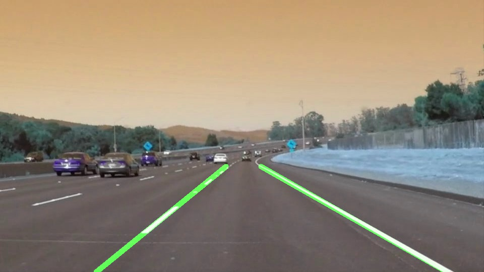
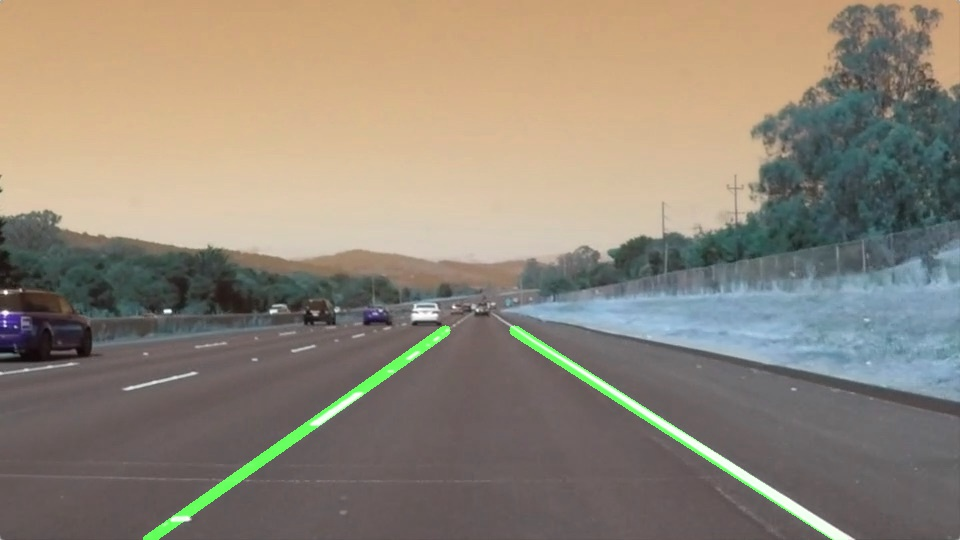
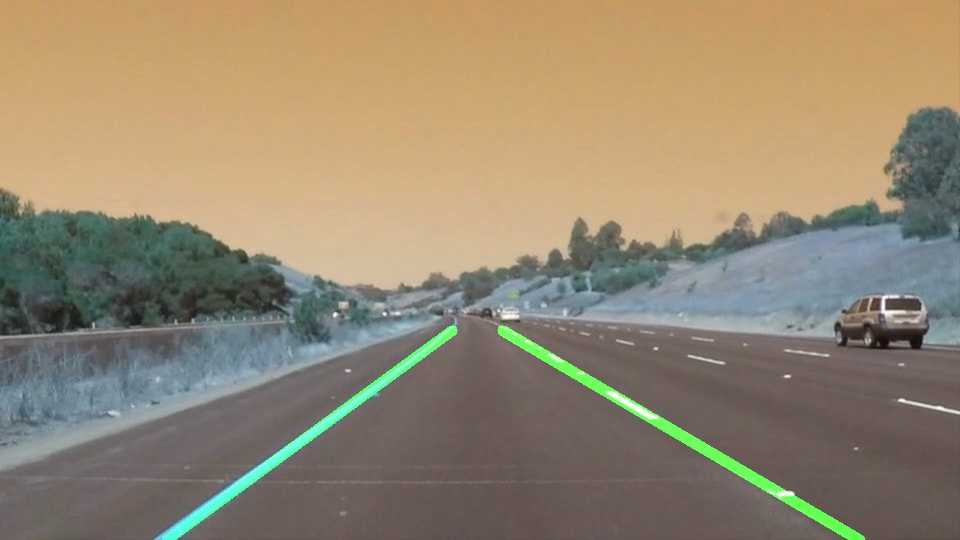
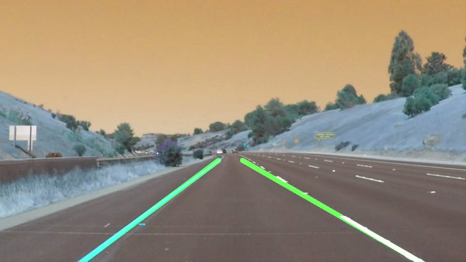
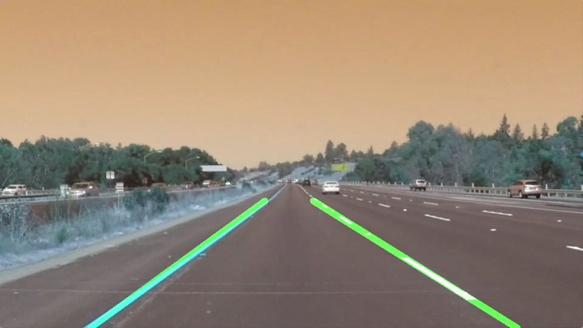
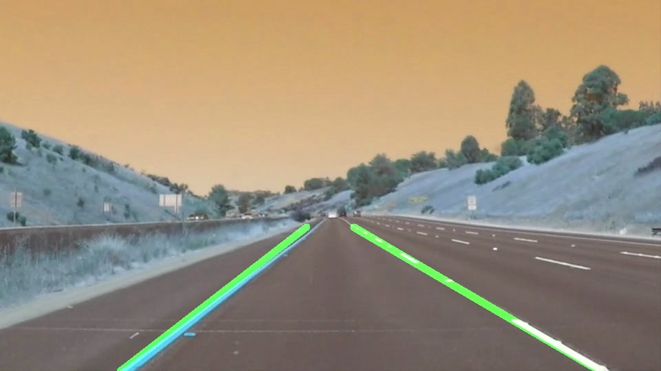

# Self Driving Car Nanodegree - P1 Finding Lane Line

## Description

**The project is implemented to find the Lane lines on the roads, This is my 1st project of Udacity self-driving car nanodegree Program. It required implementing a lane line finding software to detect lane line in a sequence of video.**
* Udacity self-driving car nanodegree:

  https://www.udacity.com/course/self-driving-car-engineer-nanodegree--nd013

### Lane line detection pipeline 

The pipeline is consisted of 6 steps. 

#### Step 1. Gray scale conversion
  Convert colored image into gray scaled image using grayscale utility function.

#### Step 2. Gaussian smoothing
  Apply Gaussian smoothing on the grayscale image to let edge features easier to find.
  
#### Step 3. Canny edge detection
  Use Canny Edge Detection technique to find edges in the Gaussian filtered image and pass the low and high threshold values as parameters.

#### Step 4. Polygon region of interest applied
  Mask out uninterested region using 4 sided polygon (left_buttom, apex, right_bottom)  

#### Step 5. Hough transform and draw annotated image
  Apply Hough Transform to find the line segments.
 
### Step 6. Draw lines 
  Modify drawlines function to average line segments to form left and right lane line and combine the 2 line with original image to form n annotated image.

In order to draw a single line on the left or right lanes, I modified the draw_lines() function by :

1. find segment whose slope between -0.6 and -0.95 to be averaged and find the average left lane line slope

2. find segment whose slope between 0.55 and 0.75 to be averaged and find the average right lane line slope

3. Average the left line segments' points to get an average point that left lane line will go through, and same method is applied to right line segments.

4. Since getting average point and slope, I calculate 2 point position along the line on bottom and half height of the image. Left lane line and right lane line are done in the same method.

5. Finally, I connected the 2 points to form the line. Both left and right lane line are drawn.

### Source Code

* The source code is in IPython notebook "./P1.ipynb". 

### Result

#### Test Image Results
<table>
  <tr>
    <td>
      

         
           
          <h5>Solid White Curve</h5>
      

    </td>
    <td>
      

        
        <h5>Solid White Right</h5>
      

    </td>
    <td>
      

        
        <h5>Solid Yellow Curve</h5>
      

    </td> 
  </tr>
  <tr></tr>
  <tr>
     <td>
      

         
           
          <h5>Solid Yellow Curve 2</h5>
      

    </td>
    <td>
      

        
        <h5>Solid Yelloe Left</h5>
      

    </td>
    <td>
      

        
        <h5>White Car Lane Switch</h5>
      

    </td>
  </tr>
</table>

#### Test Video Results:

* The lane line detected result videos :

  Here's a [link to 1st processed video](./test_videos_output/solidWhiteRight.mp4) and a [link to 2nd processed video](./test_videos_output/solidYellowLeft.mp4)

### Shortcomings of current pipeline

One potential shortcoming would be lane line not found when most of line segment slopes are out of range I restricted.

### Possible improvements to current pipeline

A possible improvement would be to record previous frames’ lane line slope and adjust the slope range based on it because the adjacent frame’s lane line slope shouldn’t vary greatly.
